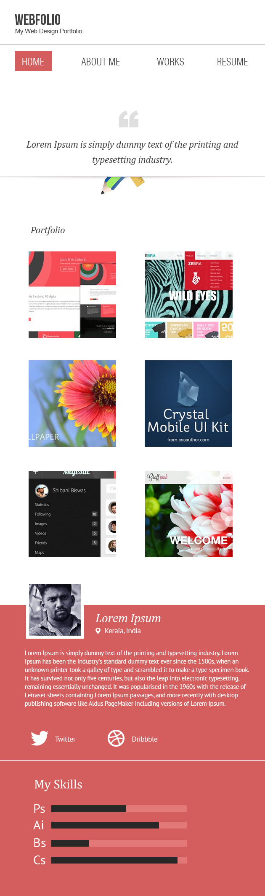

# Bài tập

Sử dụng boootstrap theo hướng dẫn bên dưới thực hiện làm giao diện file [pc.psd](pc.psd).
Khi xem trên điện thoại hoặc màn hình thiết bị nhỏ sẽ có giao diện như [mobile.psd](mobile.psd)
Khi push code lên phải có gulp file và code sass.

# Xây dựng theme từ Bootstrap

Viết sass theo đúng cách bằng cách đọc qua một số bài

  - http://thesassway.com/beginner
  
Tuts 

  - https://www.sitepoint.com/bootstrap-sass-installation-and-customisation/
  - http://treyhunner.com/2015/02/creating-a-custom-bootstrap-build/
  
Ví dụ một số tài liệu hướng dẫn tạo theme từ bootstrap

  - https://github.com/treyhunner/custom-bootstrap-example/tree/master/css

Các bước

- Đọc về cú pháp sass
- Tìm hiểu về sass và cách viết đúng http://thesassway.com/beginner (tên biến, tên class, object, ...)
- Tìm hiểu về bootstrap(các định dạng tải về, chú ý bản sass dùng để làm, xem cách build bản sass)
- Cài đặt, chạy thử [gulp-sass](https://www.npmjs.com/package/gulp-sass)
- Đọc về [css](http://getbootstrap.com/css/) để biết các css của BS để biết lõi của BS gồm những gì, xây dựng như thế nào, ...
- Đọc về [component](http://getbootstrap.com/components/) để biết các component có sẵn của BS gồm những thành phần nào, chú ý đến cấu trúc các thẻ trong ngoài, các thành phần của 1 component, cách đặt tên các thành phần và cách đặt tên biến thể của component.
- Tiến hành làm 1 ví dụ 
  + Xem các variable có thể chỉnh sửa
  + Chọn ra 5 màu tương ứng với các trạng thái primary,default,error,warning,info,error và màu gray
  + Xác định các component cần chỉnh sửa, component cần tạo biến thể và viết code vào các file riêng.
  + Tạo 1 file chung có include bootstrap và các file custom
  + Tạo có chứa các component hoặc file mẫu trên mạng sau đó chèn style sau khi biên dịch của mình vào để xem kết quả.

  
  
