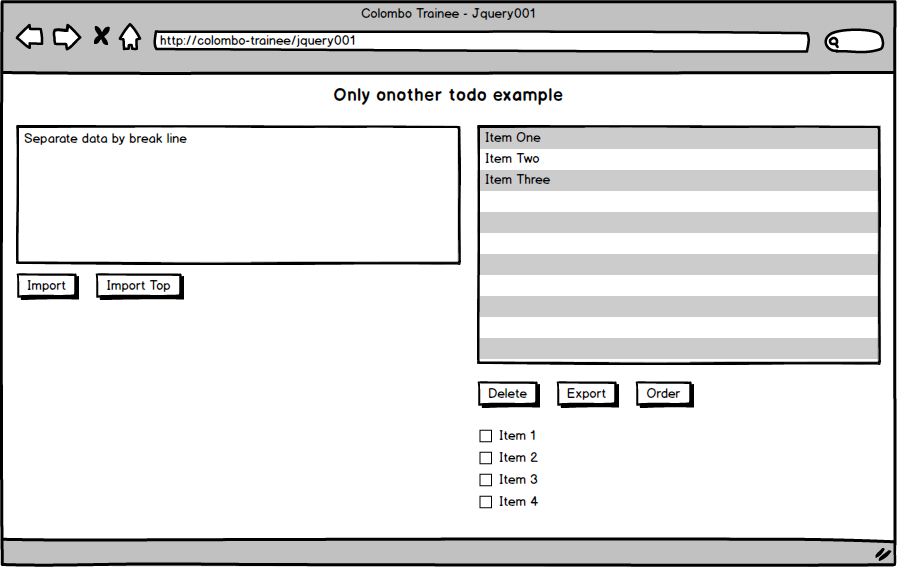

# Bài thực hành Jquery 001

## Thời gian thực hiện

- Từ 2-5 ngày

## Kiến thức chuẩn bị

- HTML/CSS
- Cơ bản javascript.

## Mục tiêu

- Làm quen jquery và các thao tác tiện dụng với DOM thông qua jquery để thay đổi trang web

## Yêu cầu

### Thiết kế giao diện html giống mockup gồm : 
- 1 `textarea`
- 1 danh sách(dùng `li` hoặc `select`)
- Các nút như hình
- **Toàn bộ `css` phải được khai báo trong thẻ `head`, toàn bộ `js` phải được viết `inline` hoặc ngay trước thẻ đóng `</body>`**

### Tính năng:
**Level 1**
- Khi người dùng nhập vào `textarea` các dòng, ví dụ
```
Dòng 1
Dòng 2
Dòng 3
```
và nhấn `Import` thì các dòng sẽ được thêm lần lượt vào danh sách bên cạnh(thêm bên cuối danh sách). Nếu nhấn `Import top` thì sẽ thêm vào phía trên danh sách. Sau khi `import`, chữ trong `textarea` sẽ bị xóa
- Khi nhấn nút xóa `delete`, mục cuối cùng trong danh sách sẽ bị xóa.
- Khi nhấn `export`, danh sách sẽ được hiển thị phía dưới hàng nút này như hình, đó là các radio input. Và danh sách lúc này được xóa rỗng.
- Khi ấn nút `order`, danh sách sẽ được sắp xếp theo vần `ABC...` 
- Khi tích chọn các radio input, nó sẽ biến mất.

**Level 2**
- Thỏa mãn level 1
- Danh sách có thể order bằng chuột, kéo 1 mục sang vị trí khác đẻ sắp xếp
- Có thể chọn 1 mục trong danh sách(mục được chọn có style khác các mục khác,ko được hiển thị thêm thành phần khác như `radio` hay `checkbox`,  có thể chọn được nhiều mục khác nhau mà không cần ấn giữ nút `ctrl` và ấn chẵn lần thì mục đó sẽ bị bỏ chọn) sau đó ấn nút `delete` để xóa mục được chọn.
- Tương tự như ấn nút `delete`, sau khi chọn và ấn nút `export` thì chỉ các mục được chọn mới được hiển thị xuống dưới và mất khỏi danh sách.
- Các mục sau khi `export` được tích chọn sẽ từ từ biến mất sau `1s`.

