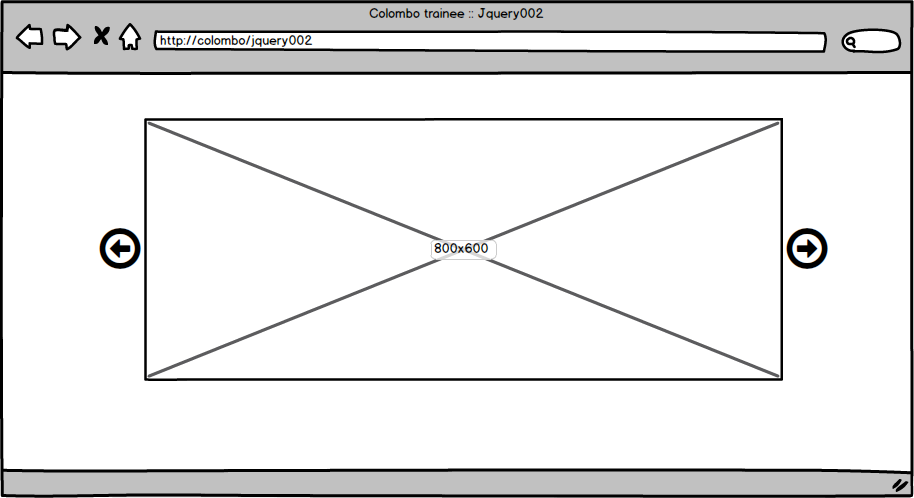
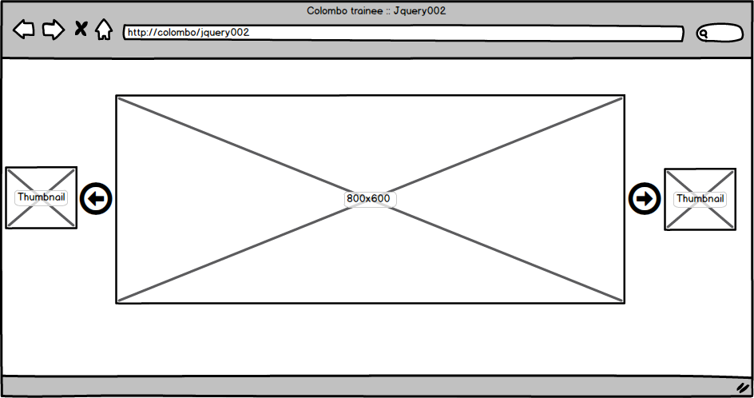
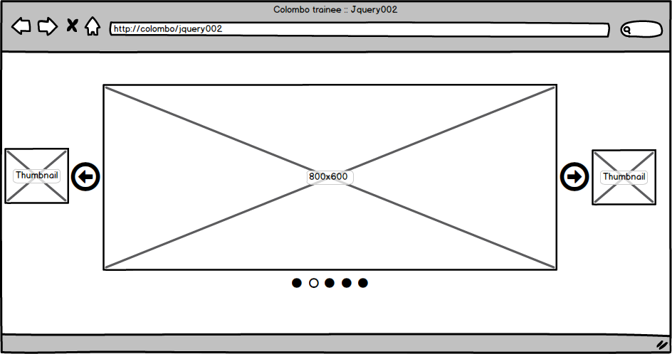

# Jquery002
Bài tập thực hành thứ 2 về jquery

## Thời gian thực hiện

**5 - 7 ngày(Part 1: 2 ngày, Part 2: 3 ngày, Part 2 level 2: 2 ngày)**

## Part1 : Áp dụng plugin jquery
_Sửa lại bài trainee007 với yêu cầu sau_

1. Trang chủ thêm 1 slide chạy hiển thị 5 người dùng mới nhất đã cập nhật ảnh, caption là tên và giới thiệu nếu có. 
2. Trang danh sách áp dụng https://datatables.net/ vào việc hiển thị danh sách.

**Chú ý trước khi thực hiện: Phải tạo branch mới và làm bài trên branch mới đó, không được ảnh hưởng đến branch `master` bài trainee007 hiện tại, branch mới có tên `jquery002`**

## Part 2 : Sử dụng Jquery tạo slide

Tạo 1 slide với mockup sau

- Level 1: 
 - Slide chạy từng ảnh 1 (có loop hoặc không loop) với time out 1s, tốc độ 500ms.
 - Ấn vào nút mũi tên, slide sẽ chạy theo hướng đã chọn ngay lập tức.
 - Khi hover vào mũi tên, sẽ hiển thị tooltip là thumbnail của slide sẽ chuyển sang sau khi ấn

- Level 2:
 - Hiển thị vị trí slide đang chạy bằng các chấm tròn phí dưới, slide đang hiển thị ở vị trí bao nhiêu thì chấm tròn đó sẽ là màu khác(có thể là màu trắng).
 - Có biến để tùy chọn : hiển thị thumnail khi hover nút mũi tên hay không, có hiển thị các chấm tròn biểu thị vị trí slide đang hiển thị hay không, _tùy chọn kiểu chuyển slide_.

